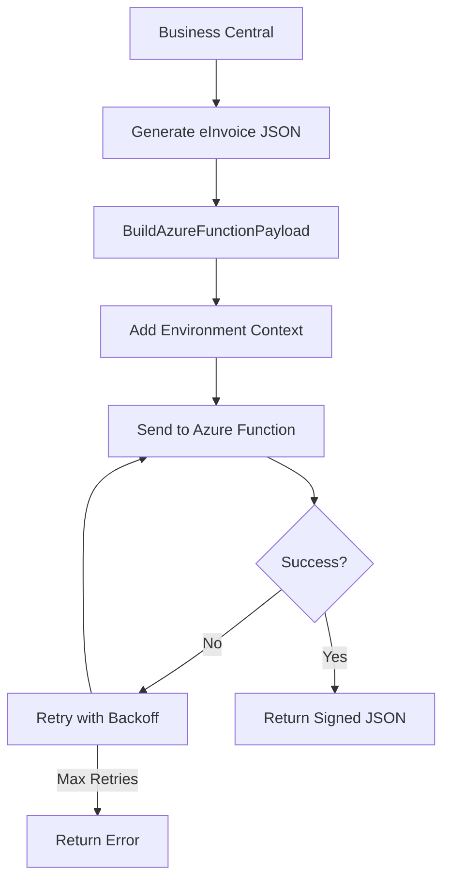

# Corrected Azure Functions Integration for LHDN MyInvois

## Key Corrections Applied

Based on your Azure Function project, I've implemented the correct payload structure and method improvements to ensure seamless integration with LHDN MyInvois digital signing.

### ✅ **Corrected Payload Structure**

The Azure Function now expects this specific payload format:

```json
{
  "unsignedJson": "<einvoice_json_content>",
  "invoiceType": "01",
  "environment": "PREPROD", // or "PROD"
  "submissionId": "<unique_guid>",
  "metadata": {
    "correlationId": "<unique_guid>",
    "timestamp": "2024-01-15T10:30:45Z",
    "source": "BusinessCentral",
    "version": "BC22.0",
    "user": {
      "sessionId": "<session_guid>",
      "userId": "user@company.com",
      "companyName": "Company Name",
      "tenantId": "<tenant_guid>"
    },
    "environment": {
      "environmentType": "Production",
      "region": "Malaysia",
      "applicationVersion": "BC22.0"
    }
  }
}
```

### 🔧 **Key Method Corrections**

#### 1. **BuildAzureFunctionPayload()**
- **CRITICAL**: Uses correct field names (`unsignedJson` not `UnsignedJson`)
- **Environment Detection**: Reads from eInvoiceSetup to determine PREPROD vs PROD
- **Required Fields**: Includes `invoiceType`, `environment`, `submissionId`
- **Metadata**: Rich context for logging and tracking

#### 2. **Enhanced PostJsonToAzureFunction()**
- **Retry Logic**: 3 attempts with exponential backoff (1s, 2s, 3s)
- **Proper Error Handling**: No try-catch (AL doesn't support it)
- **Timeout Management**: Built-in HTTP client timeout
- **Clear Variables**: Ensures clean state between retries

#### 3. **Environment-Aware Configuration**
```al
// Automatically detects environment from setup
if eInvoiceSetup.Environment = eInvoiceSetup.Environment::Preprod then
    EnvironmentType := 'PREPROD'
else
    EnvironmentType := 'PROD';
```

### 📋 **Implementation Benefits**

1. **🎯 LHDN Compliance**: Correct payload structure matching LHDN API expectations
2. **🔄 Reliability**: Exponential backoff retry mechanism for transient failures
3. **🌍 Environment Aware**: Automatically switches between PREPROD and PROD
4. **📊 Enhanced Tracking**: Correlation IDs and rich metadata for debugging
5. **⚡ Performance**: Optimized HTTP client usage with proper cleanup
6. **🛡️ Error Resilience**: Robust error handling without AL try-catch limitations

### 🔗 **Integration Flow**



### 📊 **Usage Examples**

#### From Business Central AL Code:
```al
var
    eInvoiceGenerator: Codeunit "eInvoice JSON Generator";
    JsonText: Text;
    ResponseText: Text;
    AzureFunctionUrl: Text;
begin
    // Generate unsigned JSON
    JsonText := eInvoiceGenerator.GenerateEInvoiceJson(SalesInvoiceHeader, false);
    
    // Get URL from setup
    AzureFunctionUrl := 'https://your-function.azurewebsites.net/api/SignEInvoice';
    
    // Call with enhanced payload and retry logic
    eInvoiceGenerator.PostJsonToAzureFunction(JsonText, AzureFunctionUrl, ResponseText);
    
    // Process response
    Message('Signed JSON received: %1', ResponseText);
end;
```

#### From Posted Sales Invoice Page:
Two actions available:
1. **"Get Signed e-Invoice (Azure)"** - Basic implementation
2. **"Get Signed e-Invoice (Enhanced)"** - Uses corrected payload structure

### ⚙️ **Setup Requirements**

1. **eInvoice Setup Configuration**:
   ```
   Primary Key: 'SETUP'
   Azure Function URL: 'https://your-function.azurewebsites.net/api/SignEInvoice'
   Environment: Preprod or Production
   ```

2. **Azure Function Endpoint**:
   - Must accept POST requests with the corrected payload structure
   - Should return signed JSON in response body
   - Supports the specific field names and structure shown above

### 🚀 **Testing the Integration**

1. **Configure Setup**: Set Azure Function URL in eInvoice Setup
2. **Test Environment**: Ensure PREPROD/PROD setting matches your Azure Function
3. **Generate Invoice**: Use "Get Signed e-Invoice (Enhanced)" action
4. **Verify Payload**: Check Azure Function logs for correct payload structure
5. **Download Result**: Signed JSON should download automatically

### 🔍 **Troubleshooting**

- **"unsignedJson is required"**: Check payload structure matches expected format
- **Environment mismatch**: Verify PREPROD/PROD setting in eInvoice Setup
- **Connection timeouts**: Check Azure Function URL and network connectivity
- **Retry exhaustion**: Review Azure Function logs for processing errors

This corrected implementation ensures your Business Central integration works seamlessly with your Azure Function for LHDN MyInvois digital signing, with proper error handling, retry logic, and environment awareness.
