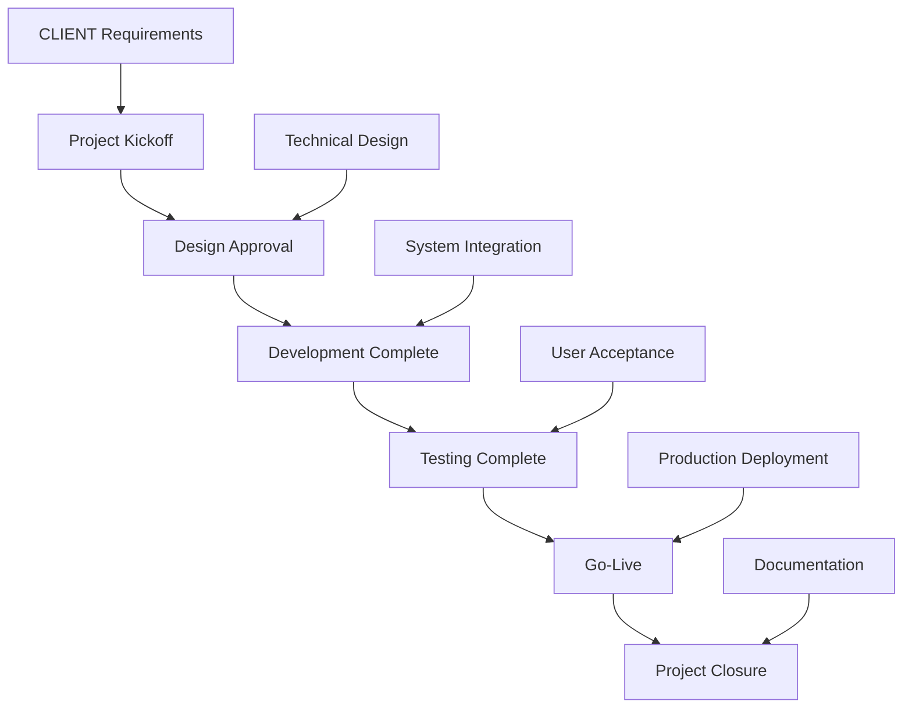

# MyInvois LHDN e-Invoice System Implementation Proposal

**Date:** August 29, 2025
**Project Status:** Development In Progress (Started July 2025)

**From:**
[Your Company Name]
[Your Company Address]
[City, State, Postcode]

**To:**
[Client Company Name]
[Client Address]
[City, State, Postcode]

**Subject:** MyInvois LHDN e-Invoice System Implementation - Progress Update

---

## Table of Contents

1. [Executive Summary](#executive-summary)
2. [Overview](#overview)
3. [Current Environment](#current-environment)
4. [Objective](#objective)
5. [Requirement](#requirements)
6. [Company Overview](#company-overview)
7. [Proposed Solutions](#proposed-solutions)
8. [Proposed Technologies](#proposed-technologies)
9. [Proposed Architecture](#proposed-architecture)
10. [Our Approach](#our-approach)
11. [Project Milestones & Deliverables](#project-milestones-deliverables)
12. [Project Plan and Estimation](#project-plan-and-estimation)
13. [Estimated Project Timeline](#estimated-project-timeline)
14. [Scope of Work](#scope-of-work)
15. [Out Of Scope](#out-of-scope)
16. [Assumptions](#assumptions)
17. [Post Support](#post-support)
18. [Standard Terms & Conditions](#standard-terms-conditions)
19. [Support and Maintenance](#support-and-maintenance)

---

## Executive Summary

### Overview

The document is to propose [Client Company Name] (hereafter refer as "CLIENT") to engage [Your Company Name] (hereafter refer as "VENDOR") to develop and implement a comprehensive MyInvois LHDN e-Invoice system for Microsoft Dynamics 365 Business Central. The solution will enable CLIENT to comply with Malaysian LHDN (Lembaga Hasil Dalam Negeri) e-Invoice requirements and streamline their invoicing processes through digital transformation.

### Current Environment

CLIENT currently manages their invoicing processes manually or through traditional systems, which leads to several operational inefficiencies:

- **Manual Invoice Processing** – Invoices are created and managed manually, leading to delays, errors, and increased administrative overhead.
- **Lack of Digital Compliance** – Current processes may not fully comply with LHDN MyInvois e-Invoice requirements, risking non-compliance penalties.
- **Limited Integration** – Invoice data may not be properly integrated with financial systems, leading to data silos and reconciliation challenges.
- **No Real-time Tracking** – Lack of visibility into invoice status, submission results, and compliance metrics.

To overcome these issues, CLIENT seeks to implement a comprehensive e-Invoice solution that integrates seamlessly with Microsoft Dynamics 365 Business Central, ensures full LHDN compliance, and provides real-time visibility into the entire invoicing lifecycle.

### Objective

To develop and deliver the MyInvois LHDN e-Invoice System for Microsoft Dynamics 365 Business Central, enabling CLIENT to:

- Achieve full compliance with LHDN MyInvois e-Invoice requirements for digital invoicing in Malaysia.
- Streamline invoice processing from creation to LHDN submission through automated workflows.
- Enable real-time tracking and monitoring of invoice status, validation results, and compliance metrics.
- Integrate seamlessly with existing Business Central processes and data structures.
- Provide comprehensive audit trails and reporting capabilities for regulatory compliance.
- Support both B2B and B2G transactions with appropriate document types and validation rules.
- Ensure secure digital signing and submission of invoices to LHDN API endpoints.
- Empower users with intuitive interfaces for invoice management and status monitoring.

### Requirement

As VENDOR understanding, CLIENT is looking for solutions which could address:

- Full UBL 2.1 compliance for generating structured JSON invoices as required by LHDN.
- Digital signing integration using JOTEX P12 certificates through Azure Functions.
- Direct API integration with LHDN MyInvois for invoice submission and status tracking.
- Seamless integration with Microsoft Dynamics 365 Business Central sales processes.
- Real-time TIN validation for customers to ensure data accuracy.
- Support for all LHDN document types (01-Invoice, 02-Credit Note, 03-Debit Note, 04-Refund Note, 11-14 Self-billed variants).
- Automated field population and validation based on Business Central data.
- Comprehensive error handling and retry mechanisms for failed submissions.
- Complete audit logging and compliance reporting capabilities.
- Role-based access control ensuring appropriate security and data visibility.
- Real-time status monitoring and logging for invoice processing.
- Bulk processing capabilities for high-volume invoice scenarios.
- Web-responsive user interfaces for cross-device accessibility.
- User-friendly interface optimized for English-speaking users.

---

## Company Overview

[Your Company Name] is a leading provider of Microsoft technology solutions, specializing in digital transformation and enterprise application development. With extensive experience in Microsoft Dynamics 365 Business Central and Azure cloud services, we deliver innovative solutions that drive business efficiency and compliance.

### Our core competencies include:

- **Enterprise Application Development** – Custom development using Microsoft technologies including Business Central, Azure, and Power Platform.
- **Digital Transformation** – Streamlining business processes through automation and cloud adoption.
- **Compliance Solutions** – Implementing regulatory compliance systems for various industries.
- **Cloud Integration** – Seamless integration with Microsoft Azure services and APIs.
- **Data Analytics** – Providing insights through logging and monitoring.
- **Quality Assurance** – Comprehensive testing and validation procedures.

We have successfully delivered numerous Business Central implementations and integrations, with particular expertise in Malaysian market requirements and LHDN compliance solutions.

---

## Proposed Solutions

### Overview

VENDOR is proposing CLIENT to implement the MyInvois LHDN e-Invoice System using Microsoft Dynamics 365 Business Central extension with Azure cloud services integration. The solution leverages:

- **Business Central Extension** – Core e-Invoice processing and UI integration.
- **Azure Functions** – Secure digital signing service for invoice authentication.
- **LHDN API Integration** – Direct submission to MyInvois platform.
- **Secure Storage Solutions** – Document and log storage with encryption.
- **Certificate Management** – Secure JOTEX P12 certificate handling and lifecycle management.

The proposed solution will transform CLIENT's invoicing processes from manual to fully automated digital compliance, ensuring regulatory adherence while improving operational efficiency.

### MyInvois LHDN e-Invoice System

The proposed solution will leverage Microsoft Dynamics 365 Business Central extension with Azure cloud services to digitize and automate the e-Invoice process.

#### Complete End-to-End Workflow:

```
┌─────────────────┐    ┌──────────────────┐    ┌─────────────────┐
│   Business      │    │   e-Invoice       │    │   Azure Function │
│   Central User  │────│   Processing      │────│   Digital Signing│
│                 │    │                   │    │                 │
│ • Create Invoice│    │ • Field Validation│    │ • XAdES Signing │
│ • Post Document │    │ • TIN Validation │    │ • Certificate    │
│ • Monitor Status│    │ • JSON Generation│    │ • LHDN Payload  │
└─────────────────┘    └──────────────────┘    └─────────────────┘
         │                        │                        │
         │                        │                        │
         ▼                        ▼                        ▼
┌─────────────────┐    ┌──────────────────┐    ┌─────────────────┐
│   LHDN MyInvois │    │   Status Updates  │    │   Audit Trail   │
│   API Submission│    │   & Monitoring    │    │   & Logging     │
│                 │    │                  │    │                 │
│ • Document Submit│    │ • Real-time Status│    │ • Complete Log │
│ • Status Polling │    │ • Status Updates  │    │ • Compliance   │
└─────────────────┘    └──────────────────┘    └─────────────────┘
```

**Detailed Process Flow:**

1. **📄 Document Creation**: User creates sales invoice/order in Business Central
2. **🔍 Field Validation**: System auto-validates and populates e-Invoice fields
3. **✅ TIN Validation**: Real-time TIN validation with LHDN API
4. **🌍 Master Data Check**: Validates state/country/classification codes
5. **📋 JSON Generation**: Creates UBL 2.1 compliant structure
6. **🔒 Secure Transmission**: Sends JSON to Azure Function via HTTPS
7. **✍️ Digital Signing**: Azure Function applies XAdES signature with JOTEX certificate
8. **📦 Payload Preparation**: Creates LHDN-ready submission payload with base64 document
9. **📤 API Submission**: Submits signed document to LHDN MyInvois API
10. **📊 Status Monitoring**: Tracks submission with real-time updates
11. **📝 Audit Logging**: Complete transaction history with correlation IDs
12. **📊 Status Monitoring**: Real-time status updates via integrated dashboards

The solution supports all LHDN document types and ensures complete compliance with current regulations.

#### Key Features:

**Integrated e-Invoice System:**
- **Comprehensive Business Logic**: Complete automated workflow for e-Invoice processing
- **Smart Automation**: Automatic field population and validation during document creation
- **Real-time TIN Validation**: Direct regulatory API integration for customer verification
- **Standard Document Generation**: Complete structured document creation with all required fields
- **Multi-Document Support**: Invoices, Credit Notes, Debit Notes, and Self-billed variants
- **Master Data Management**: Complete reference data management for compliance
- **Audit Trail**: Comprehensive transaction logging and event tracking
- **Intelligent Error Handling**: Automated retry mechanisms with clear user feedback
- **High-Volume Processing**: Efficient bulk document handling capabilities

**Azure Function Integration:**
- **XAdES Digital Signing**: Official LHDN 7-step signing process with JOTEX certificates
- **Environment-Specific**: Separate PREPROD and PRODUCTION certificate handling
- **Security**: File-based certificate management with proper access controls
- **Performance**: Sub-second signing with comprehensive error handling

**User Experience:**
- **Seamless Integration**: Works within standard Business Central workflows
- **Real-time Status**: Live monitoring of submission status and processing
- **Web-Responsive**: Cross-device compatibility for all interfaces
- **User-Friendly**: Intuitive English interface for all users
- **Role-Based Access**: Appropriate security and data visibility controls

---

## Proposed Technologies

### Microsoft Dynamics 365 Business Central

Business Central serves as the core platform for invoice creation and management, providing a robust foundation for e-Invoice processing.

#### Core Capabilities:
- **Version**: Microsoft Dynamics 365 Business Central 2022 Wave 2 or later
- **Custom Extension**: Complete e-Invoice solution with comprehensive business logic and functionality
- **Integrated Components**: Structured system components for seamless data flow and processing
- **Enhanced Data Models**: Extended customer, sales document, item, and vendor data structures
- **User Interface Enhancements**: Integrated dashboards and monitoring interfaces
- **Business Processing Engine**: Automated workflows for document generation, validation, and submission
- **Master Data Tables**: 12 reference tables for state codes, country codes, classifications, and audit logs
- **Reports**: Batch processing reports for bulk invoice and credit memo exports
- **Event Subscribers**: Automatic field population and validation on document creation/modification
- **Workflow Integration**: Native integration with standard Business Central sales and posting processes

#### Key Benefits:
- **Unified Platform**: Single system for ERP and e-Invoice compliance
- **Real-time Processing**: Immediate validation and status updates
- **Scalability**: Handles high-volume invoice processing efficiently
- **Customization**: Flexible extension model for specific business requirements
- **Security**: Built-in role-based security and audit trails

### Microsoft Azure Cloud Services

Azure provides enterprise-grade cloud infrastructure and services for secure, scalable e-Invoice processing.

#### Core Services:

##### Azure Functions v4
- **Runtime**: .NET 8.0 Isolated Process Model
- **Reference Implementation**: https://github.com/acutraaq/eInvAzureSign
- **Trigger Types**: HTTP triggers for API endpoints, Timer triggers for scheduled tasks
- **Scaling**: Consumption plan with automatic scaling (1-200 instances)
- **Security**: Integrated with Azure Active Directory and secure certificate management
- **Monitoring**: Application Insights integration for performance tracking
- **Certificate Management**: Secure JOTEX P12 certificate handling
- **Benefits**: Serverless architecture reduces operational overhead, automatic scaling for peak loads
- **Production Ready**: Based on proven implementation with JOTEX certificate integration

##### Certificate Management
- **JOTEX P12 Certificates**: File-based certificate storage and management
- **Environment-Specific Loading**: PREPROD and PRODUCTION certificate handling
- **Serial Number Extraction**: Decimal format extraction for LHDN compliance
- **Access Control**: Secure certificate access with proper authentication
- **Compliance**: Malaysian Digital Signature Standard (DSS) compliance
- **Benefits**: Production-ready implementation, no Key Vault dependency

##### Azure Monitor and Application Insights
- **Metrics Collection**: Real-time performance and health metrics
- **Log Analytics**: Centralized logging and query capabilities
- **Monitoring**: Comprehensive performance and health monitoring
- **Logging**: Comprehensive request/response logging
- **Integration**: Native integration with Azure Functions
- **Benefits**: Proactive monitoring, rapid issue detection and resolution

### Digital Security Technologies

Security technologies ensure compliance with Malaysian regulations and protect sensitive financial data.

#### Digital Signature Infrastructure:
- **JOTEX P12 Certificates**: Malaysian Digital Signature Standard (DSS) compliant
- **Certificate Loading**: Environment-specific file-based certificate management
- **XAdES Implementation**: Official LHDN 7-step signing process
- **Signature Algorithm**: RSA 2048-bit with SHA-256 hashing
- **Serial Number Handling**: Decimal format extraction for LHDN compliance
- **Compliance**: Meets Malaysian Communications and Multimedia Commission (MCMC) requirements

#### Data Protection:
- **Encryption at Rest**: AES-256 encryption for all stored data
- **Encryption in Transit**: TLS 1.3 for all network communications
- **Data Masking**: Sensitive data masking in logs and user interfaces
- **Tokenization**: PCI DSS compliant tokenization for payment data

#### Authentication and Authorization:
- **OAuth 2.0**: Industry-standard authorization framework
- **JWT Tokens**: JSON Web Tokens for secure API authentication
- **API Keys**: Secure API key management with rotation policies
- **Certificate-based Authentication**: Mutual TLS for high-security scenarios

#### Security Monitoring:
- **Application Insights**: Real-time performance and security monitoring
- **Certificate Validation**: Automated certificate expiry monitoring
- **Request Validation**: Input validation and sanitization
- **Error Logging**: Comprehensive security event logging
- **Correlation Tracking**: Request correlation for security analysis

### LHDN MyInvois API Integration

Direct integration with the official LHDN MyInvois platform ensures regulatory compliance and seamless document submission.

#### API Endpoints and Capabilities:

##### Document Submission API
- **Endpoint**: `POST /api/v1.0/documentsubmissions`
- **Authentication**: OAuth 2.0 Bearer tokens
- **Payload Format**: JSON with UBL 2.1 structure
- **Rate Limits**: 100 requests per minute, 10,000 per hour
- **Response Format**: JSON with submission ID and status
- **Error Handling**: Detailed error codes and messages

##### Document Status Retrieval API
- **Endpoint**: `GET /api/v1.0/documents/{documentId}`
- **Authentication**: OAuth 2.0 Bearer tokens
- **Response Format**: JSON with detailed status information
- **Real-time Updates**: Status polling every 30 seconds
- **Historical Data**: 90-day status history retention

##### TIN Validation API
- **Endpoint**: `GET /api/v1.0/taxpayer/validation/{tin}`
- **Authentication**: OAuth 2.0 Bearer tokens
- **Response Format**: JSON with validation status and taxpayer details
- **Caching**: 24-hour validation result caching
- **Error Handling**: Invalid TIN format detection

##### Bulk Submission API
- **Endpoint**: `POST /api/v1.0/documentsubmissions/batch`
- **Batch Size**: Maximum 50 documents per batch
- **Processing**: Asynchronous processing with status callbacks
- **Error Handling**: Individual document error reporting
- **Benefits**: Efficient bulk processing for high-volume scenarios

#### API Integration Features:
- **Automatic Retries**: Intelligent retry logic with exponential backoff
- **Circuit Breaker**: Automatic failover for API unavailability
- **Request Throttling**: Respectful rate limiting to prevent API rejection
- **Response Caching**: Intelligent caching to reduce API calls
- **Error Classification**: Automated error categorization and handling

---

## Proposed Architecture

### System Architecture Overview

The proposed architecture follows a layered approach ensuring scalability, security, and maintainability:

```
╔══════════════════════════════════════════════════════════════════════════════╗
║                         BUSINESS CENTRAL LAYER                              ║
╠══════════════════════════════════════════════════════════════════════════════╣
║  ┌─────────────────────────────────────────────────────────────────────┐    ║
║  │                    USER INTERFACE LAYER (20+ Pages)                 │    ║
║  │  • Setup Pages: Configuration & Master Data Management             │    ║
║  │  • Operational Pages: Status Monitoring & Logs                     │    ║
║  │  • Document Extensions: Seamless Workflow Integration               │    ║
║  └─────────────────────────────────────────────────────────────────────┘    ║
║                                                                             ║
║  ┌─────────────────────────────────────────────────────────────────────┐    ║
║  │                    BUSINESS LOGIC LAYER (Processing Engine)         │    ║
║  │  • Document Generation & Regulatory Submission Orchestrator         │    ║
║  │  • Standard Document Builder                                        │    ║
║  │  • Secure Communication Client                                      │    ║
║  │  • Tax Validation with Regulatory API                               │    ║
║  │  • Automated Field Population                                       │    ║
║  │  • Status Tracking & Management                                     │    ║
║  └─────────────────────────────────────────────────────────────────────┘    ║
║                                                                             ║
║  ┌─────────────────────────────────────────────────────────────────────┐    ║
║  │                    DATA MODEL LAYER (Enhanced Data Structures)      │    ║
║  │  • Customer Data: Tax ID, Identification, Address Information       │    ║
║  │  • Sales Document Data: e-Invoice Fields and Metadata               │    ║
║  │  • Reference Data: Geographic and Currency Code Management          │    ║
║  │  • Audit Data: Transaction Logs, Validation History                 │    ║
║  └─────────────────────────────────────────────────────────────────────┘    ║
╚══════════════════════════════════════════════════════════════════════════════╝
                                     │
                                     ▼
╔══════════════════════════════════════════════════════════════════════════════╗
║                       AZURE INTEGRATION LAYER                              ║
╠══════════════════════════════════════════════════════════════════════════════╣
║  ┌─────────────────────────────────────────────────────────────────────┐    ║
║  │                    AZURE FUNCTIONS (5 Endpoints)                     │    ║
║  │  • POST /api/eInvSigning - General document signing                 │    ║
║  │  • POST /api/BusinessCentralSigning - BC optimized signing          │    ║
║  │  • GET /api/health - Health check endpoint                          │    ║
║  │  • GET/POST /api/connectivity-test - Connection validation          │    ║
║  │  • POST /api/validate - Signature validation                        │    ║
║  └─────────────────────────────────────────────────────────────────────┘    ║
║                                                                             ║
║  ┌─────────────────────────────────────────────────────────────────────┐    ║
║  │                    SECURITY & CERTIFICATES                          │    ║
║  │  • File-Based JOTEX P12 Certificate Management                     │    ║
║  │  • Environment-Specific Loading (PREPROD/PROD)                     │    ║
║  │  • XAdES Digital Signature (7-Step LHDN Process)                    │    ║
║  │  • Serial Number Extraction for LHDN Compliance                    │    ║
║  └─────────────────────────────────────────────────────────────────────┘    ║
║                                                                             ║
║  ┌─────────────────────────────────────────────────────────────────────┐    ║
║  │                    MONITORING & LOGGING                             │    ║
║  │  • Application Insights Integration                                │    ║
║  │  • Request/Response Logging with Correlation IDs                   │    ║
║  │  • Performance Metrics & Error Tracking                            │    ║
║  └─────────────────────────────────────────────────────────────────────┘    ║
╚══════════════════════════════════════════════════════════════════════════════╝
                                     │
                                     ▼
╔══════════════════════════════════════════════════════════════════════════════╗
║                         LHDN INTEGRATION LAYER                             ║
╠══════════════════════════════════════════════════════════════════════════════╣
║  ┌─────────────────────────────────────────────────────────────────────┐    ║
║  │                    LHDN MYINVOIS API                                │    ║
║  │  • POST /api/v1.0/documentsubmissions - Document submission         │    ║
║  │  • GET /api/v1.0/documents/{id} - Status retrieval                  │    ║
║  │  • GET /api/v1.0/taxpayer/validation/{tin} - TIN validation        │    ║
║  │  • POST /api/v1.0/documentsubmissions/batch - Bulk submission       │    ║
║  └─────────────────────────────────────────────────────────────────────┘    ║
║                                                                             ║
║  ┌─────────────────────────────────────────────────────────────────────┐    ║
║  │                    API SECURITY & AUTHENTICATION                     │    ║
║  │  • OAuth 2.0 Client Credentials Flow                                │    ║
║  │  • JWT Token Management                                             │    ║
║  │  • Request Signing & Verification                                   │    ║
║  │  • Rate Limiting & Throttling                                       │    ║
║  └─────────────────────────────────────────────────────────────────────┘    ║
╚══════════════════════════════════════════════════════════════════════════════╝
```

### Component Interaction Flow

```
┌─────────────────┐ HTTPS/JSON   ┌──────────────────────┐
│ Business Central│──────────────▶│ Azure Functions     │
│ e-Invoice System│               │ (Digital Signing)   │
│ Processing      │◀──────────────│ Service             │
└─────────────────┘   Signed Doc  └──────────────────────┘
         │                                        │
         │ HTTPS/OAuth 2.0                       │
         ▼                                        ▼
┌─────────────────┐                        ┌──────────────────────┐
│ LHDN MyInvois   │◀──────────────────────▶│ Certificate Store     │
│ API Platform    │   Status Updates       │ (JOTEX P12 Files)    │
│                 │                        │                      │
└─────────────────┘                        └──────────────────────┘
         │                                        │
         │ Data Operations                        │
         ▼                                        ▼
┌─────────────────┐                        ┌──────────────────────┐
│ Business Central│◀──────────────────────▶│ Application Insights │
│ Data & Audit    │   Audit Logs           │ (Monitoring)         │
│ Trail           │                        │                      │
└─────────────────┘                        └──────────────────────┘
         │                                        │
         │ UI Updates                             │
         ▼                                        ▼
┌─────────────────┐                        ┌──────────────────────┐
│ User Interface  │◀──────────────────────▶│ Monitoring Dashboard │
│ (Web Portal)    │   Status Updates       │ & Reporting         │
│ & Dashboards    │                        │                      │
└─────────────────┘                        └──────────────────────┘
```

### Architecture Benefits

- **🏗️ High Availability**: Redundant components with automatic failover mechanisms
- **📈 Scalability**: Auto-scaling Azure Functions handle variable loads efficiently
- **🔒 Security**: End-to-end encryption with certificate-based authentication
- **📋 Compliance**: Full LHDN regulatory compliance with comprehensive audit trails
- **🔧 Maintainability**: Modular design with clear separation of concerns
- **📊 Monitoring**: Real-time observability with Application Insights integration
- **🔄 Integration**: Seamless integration with existing Business Central workflows
- **⚡ Performance**: Optimized for high-volume processing with intelligent caching
- **🛡️ Reliability**: Comprehensive error handling and automatic retry mechanisms
- **📱 User Experience**: Intuitive interfaces with real-time status updates

---

## Our Approach

We approach all our projects following the Microsoft Solutions Framework (MSF) methodology, which consists of 5 phases:

### 1. Envisioning Phase
– Project initiation, stakeholder alignment, and scope definition.

### 2. Planning Phase
– Technical design, architecture planning, and detailed project planning.

### 3. Developing Phase
– Solution development, testing, and quality assurance.

### 4. Stabilizing Phase
– System integration testing, user acceptance testing, and final validation.

### 5. Deploying Phase
– Production deployment, data migration, and go-live support.

### Project Phases

| Activities/Deliverables | Milestones |
|------------------------|------------|
| Envisioning: Team and stakeholder alignment, risk and environment assessment, requirement gathering sessions, define scope, features, and success criteria, prepare initial project plan | Vision/Scope Approved (5 man-days) |
| Planning: Environment and license review, conceptual design of user interface and data models, define access matrix and security roles, draft functional specification, identify test plan and use cases | Functional Specification Conceptual Design (12 man-days) |
| Developing: Configure cloud and ERP environments, develop e-Invoice system with core functionality, implement secure digital signing services, configure regulatory API integration and authentication, design user interfaces and monitoring dashboards, perform system integration testing, identify pilot users for testing and feedback | Development (60 man-days) |
| Stabilizing: Prepare and deploy staging environment, conduct User Acceptance Testing (UAT) with pilot users, apply fixes and improvements from UAT feedback | Test Lab Testing (10 man-days) |
| Deploying: Configure production environment, execute data migration and validation, deploy solution to production, conduct user training and knowledge transfer, provide go-live support and monitoring | Implementation & Deployment (8 man-days) |

---

## Project Plan and Estimation

Below are estimated project plan and timeline.

| Phase | Deliverables | Milestone |
|-------|-------------|-----------|
| **Envisioning** | • Team and stakeholder alignment<br>• Risk and environment assessment<br>• Requirement gathering sessions<br>• Define scope, features, and success criteria<br>• Prepare initial project plan | Vision Scope (5 man-days) |
| **Planning** | • Environment and license review<br>• Conceptual design of user interface and data models<br>• Define access matrix and security roles<br>• Draft functional specification<br>• Identify test plan and use cases | Functional Specification Conceptual Design (12 man-days) |
| **Developing** | • Configure Azure and Business Central environments<br>• Develop AL extension with core e-Invoice functionality<br>• Implement Azure Functions for digital signing<br>• Configure LHDN API integration and authentication<br>• Design user interfaces and status monitoring<br>• Perform System Integration Testing (SIT)<br>• Identify pilot users for testing and feedback | Development (60 man-days) |
| **Testing (SIT/UAT)** | • Set up test/staging environment<br>• Perform System Integration Testing (SIT)<br>• Conduct User Acceptance Testing (UAT) with pilot users<br>• Apply fixes and improvements from UAT feedback | Test Lab Testing (10 man-days) |
| **Stabilizing** | • Finalize staging deployment<br>• Performance tuning<br>• Validate readiness for production rollout | Pilot and staging (8 man-days) |
| **Deploying** | • Deploy solution to production environment<br>• Final security and permission configuration<br>• Monitor go-live performance and verify critical workflows | Implementation & Deployment (8 man-days) |
| **Project Closure** | • Conduct final project review and feedback session<br>• Prepare and hand over all documentation<br>• Conduct knowledge transfer and admin training<br>• Obtain final sign-off from CLIENT stakeholders | Project Closure (5 man-days) |

---

## Project Milestones & Deliverables

### Key Project Milestones

The project is structured around six major milestones, each representing a critical phase completion and quality gate:

| **Milestone** | **Description** | **Deliverables** | **Duration** | **Success Criteria** |
|---------------|-----------------|------------------|--------------|---------------------|
| **🏁 M1: Project Kickoff** | Project initiation and planning phase completion | • Project charter<br>• Initial requirements document<br>• Project plan<br>• Team assignments | 3 days | • All stakeholders aligned<br>• Requirements baseline established<br>• Project plan approved |
| **📋 M2: Design Approval** | Technical design and architecture completion | • Functional specifications<br>• Technical design documents<br>• UI/UX mockups<br>• Security architecture | 5 days | • Design review completed<br>• CLIENT approval obtained<br>• Technical feasibility confirmed |
| **⚙️ M3: Development Complete** | Core system development and integration finished | • Fully functional e-Invoice system<br>• Integration testing completed<br>• User documentation<br>• Test cases prepared | 20 days | • All features implemented<br>• System integration tested<br>• Code review completed<br>• SIT passed |
| **🧪 M4: Testing Complete** | Quality assurance and validation finished | • UAT test results<br>• Performance test reports<br>• Security audit results<br>• Go-live readiness assessment | 10 days | • UAT sign-off obtained<br>• All critical defects resolved<br>• Performance benchmarks met<br>• Security compliance verified |
| **🚀 M5: Go-Live** | Production deployment and handover | • Production system deployed<br>• User training completed<br>• Data migration finished<br>• Go-live support provided | 5 days | • System stable in production<br>• Users trained and confident<br>• Business processes validated<br>• Support handover completed |
| **✅ M6: Project Closure** | Final deliverables and project sign-off | • Complete documentation set<br>• Knowledge transfer completed<br>• Final project review<br>• Maintenance procedures established | 3 days | • All deliverables accepted<br>• CLIENT satisfaction confirmed<br>• Support team fully trained<br>• Project closure report approved |

### Milestone Dependencies & Critical Path



### Milestone Review Process

Each milestone includes a formal review process:

1. **📋 Milestone Preparation** (2 days before)
   - Deliverable completion verification
   - Quality assurance review
   - CLIENT stakeholder preparation

2. **🏛️ Milestone Review Meeting** (1 day)
   - Presentation of deliverables
   - Demonstration of functionality
   - Issue identification and resolution
   - CLIENT feedback collection

3. **✅ Milestone Sign-Off** (1 day)
   - Formal approval documentation
   - Issue resolution confirmation
   - Next phase planning
   - Risk assessment update

### Milestone Success Metrics

| **Milestone** | **Key Metrics** | **Target** | **Status** | **Timeline** |
|---------------|-----------------|------------|------------|-------------|
| **✅ M1: Kickoff** | • Requirements completeness<br>• Stakeholder alignment | 100% | **Completed** | July 2025 |
| **✅ M2: Design** | • Design review feedback<br>• Technical feasibility | >95% positive | **Completed** | July 2025 |
| **🔄 M3: Development** | • Feature completion<br>• Code quality<br>• Integration test pass rate | 100% / A grade / >98% | **In Progress** | Aug-Sep 2025 |
| **⏳ M4: Testing** | • UAT pass rate<br>• Performance benchmarks<br>• Security compliance | >95% / Met / 100% | **Pending** | Sep-Oct 2025 |
| **⏳ M5: Go-Live** | • System uptime<br>• User adoption<br>• Support ticket volume | >99.5% / >80% / <5/day | **Pending** | Oct 2025 |
| **⏳ M6: Closure** | • Documentation completeness<br>• Knowledge transfer<br>• CLIENT satisfaction | 100% / Complete / >4/5 | **Pending** | Oct 2025 |

## Current Project Status & Timeline

**Project Start Date:** July 2025
**Current Status:** Development in Progress

### Project Timeline Overview

The project is currently in the development phase with the following adjusted timeline from July 2025 onwards:

| Task Description | Duration | July-Aug 2025 | Aug-Sep 2025 | Sep-Oct 2025 |
|------------------|----------|---------------|--------------|-------------|
| **✅ Envisioning & Planning** | 10 days | Completed | | |
| **🔄 Core Development** | 25 days | In Progress | W1-W2 | |
| **⏳ Integration & Testing** | 15 days | | W2-W4 | W1 |
| **⏳ Deployment & Go-Live** | 8 days | | | W2 |
| **⏳ Project Closure** | 3 days | | | W2 |

### Current Development Status (August 2025)

#### **Completed Milestones:**
- ✅ **M1: Project Kickoff** - Completed (July 2025)
- ✅ **M2: Design Approval** - Completed (July 2025)
- 🔄 **M3: Development Complete** - In Progress (August 2025)

#### **Current Activities:**
- Core Business Central extension development
- Azure Functions implementation
- LHDN API integration setup
- Initial testing and validation

### Remaining Timeline (September-October 2025)

#### **September 2025: Testing & Finalization**
- **Week 1**: Core development completion, comprehensive testing begins
- **Week 2**: User acceptance testing, performance optimization
- **Week 3**: Final testing, bug fixes, production environment setup
- **Week 4**: Production deployment preparation, user training setup

#### **October 2025: Deployment & Closure**
- **Week 1**: Production deployment, go-live support
- **Week 2**: Final testing in production, project handover, closure

### Timeline Assumptions
- **Working Days**: 22 days per month (Monday-Friday, excluding holidays)
- **Parallel Work**: Development and testing phases overlap where possible
- **Client Availability**: Daily collaboration during testing phases
- **Prerequisites**: All required access and credentials available from project start

### Malaysian Public Holidays 2025 Impact

The 2-month timeline accounts for the following Malaysian public holidays in 2025:

#### **Federal Territory Holidays:**
- **New Year's Day**: January 1
- **Chinese New Year**: January 29-30
- **Labour Day**: May 1
- **Vesak Day**: May 12
- **Hari Raya Puasa**: March 31-April 1
- **Hari Raya Haji**: June 17
- **National Day**: August 31
- **Malaysia Day**: September 16
- **Deepavali**: October 20
- **Christmas Day**: December 25

#### **Timeline Adjustment:**
- **Estimated Holiday Impact**: 2-3 working days lost per month due to public holidays
- **Contingency Built-in**: Timeline assumes project starts on a Monday and avoids major holiday periods
- **Holiday Coordination**: Team will plan around holidays to minimize impact
- **Make-up Time**: Any holiday-related delays will be compensated by accelerated work in adjacent weeks

**Note:** If the project timeline conflicts with major holiday periods (e.g., Chinese New Year, Hari Raya), we can adjust the start date to ensure optimal productivity.

### Critical Success Factors
- **Daily Stand-ups**: Brief progress updates and issue resolution
- **Weekly Reviews**: Milestone verification and course correction
- **Immediate Feedback**: Rapid response to testing results
- **Resource Availability**: Dedicated team members throughout project

**Note:** This accelerated timeline requires close collaboration and assumes all prerequisites are met. Any delays in client feedback or prerequisite delivery may impact the schedule.

---

## Scope of Work

The proposed solutions involve development, implementation, and deployment of the MyInvois LHDN e-Invoice System for Microsoft Dynamics 365 Business Central.

### In Scope:
- Perform environment study and gap analysis
- Understand CLIENT's business and compliance requirements
- Confirming Scope and Functional Specification
- Preparing Functional Specification & Requirement Documentation
- **Milestone: Envisioning Phase Sign-Off**

- Design integrated ERP system architecture
- Develop e-Invoice system with core functionality
- Implement secure digital signing services
- Configure regulatory API integration and authentication
- Design user interfaces and monitoring dashboards
- **Milestone: Design Approved**

- Develop integrated system components
- Implement enhanced data structures and user interfaces
- Develop automated processing workflows and API integration
- Create secure digital signing services
- Implement comprehensive error handling and recovery mechanisms
- **Milestone: Development Complete**

- Configure test environments and test data
- Perform unit testing and integration testing
- Conduct user acceptance testing with CLIENT team
- Execute performance and security testing
- Validate LHDN compliance and documentation
- **Milestone: Testing Complete**

- Configure production environment
- Execute data migration and validation
- Deploy solution to production
- Conduct user training and knowledge transfer
- Provide go-live support and monitoring
- **Milestone: Deployment Complete**

- Prepare comprehensive documentation
- Conduct project closure and handover
- Provide post-implementation support
- Establish ongoing maintenance procedures
- **Milestone: Project Closure**

---

## Out Of Scope

- Third-party system integrations not specified in requirements
- Custom reporting beyond standard e-Invoice reports
- Mobile app development (web-responsive design only)
- Offline functionality and local data synchronization
- Advanced analytics and business intelligence features
- Multi-company deployment (single company scope)
- Legacy system data migration (Business Central data only)
- Hardware procurement and infrastructure setup
- Network security configuration and firewall management
- Backup and disaster recovery system implementation

---

## Assumptions

The following assumptions are made in this proposal:

- The project timeline is based on best-case estimates and actual effort may vary based on complexity discovered during implementation.
- CLIENT will provide timely access to required systems, data, and stakeholders for requirement gathering and testing.
- Business Central environment is properly licensed and configured with necessary permissions.
- CLIENT will provide LHDN PREPROD credentials and certificates for testing and development.
- Azure subscription and resources will be provided by CLIENT or procured as part of the project.
- Digital certificates (JOTEX P12) will be procured by CLIENT and provided to VENDOR.
- Test data and scenarios will be provided by CLIENT for comprehensive testing.
- CLIENT's IT team will collaborate closely during development, testing, and deployment phases.
- Network connectivity and security policies allow required Azure and LHDN API communications.
- CLIENT will perform regular backups of Business Central data throughout the project.

---

## Post Support

VENDOR will provide 30 days post-implementation support after go-live for the developed solution. This includes:

- Daily monitoring and health checks
- Issue resolution and troubleshooting
- User guidance and training
- Performance optimization recommendations
- Knowledge transfer sessions
- Emergency support during business hours

---

## Standard Terms & Conditions

CLIENT agrees to pay VENDOR based on the agreed contractual sum plus all travel and other expenses incurred in association with the project work. VENDOR cannot confirm the availability of the above resources until CLIENT agrees and signed acceptance of this proposal. At least two (2) weeks are needed for VENDOR to mobilize its resources for the project.

Should there be additional time needed by VENDOR for the project (i.e., more time needed due to changes in project scope), VENDOR shall highlight to CLIENT.

This proposal expires on **December 31, 2025**, unless otherwise agreed to by both parties.

---

## Support and Maintenance

### Overview

VENDOR will provide comprehensive support and maintenance services for the implemented MyInvois LHDN e-Invoice System, ensuring optimal performance, security, and compliance.

### Standard Business Hours

For the purpose of the following section of this proposal, the standard business hours shall be defined as below:

**Monday to Friday (9:00am to 6:00pm) Malaysia time**, excluding weekends and national public holidays gazetted in Malaysia.

Extended support shall be defined as any other support time other than the standard business hours.

### Support Location

For the purposes of the following sections of this proposal, the supported location shall be defined as below:

**[CLIENT Office Address]**

Should CLIENT decide to shift the location of support, CLIENT must provide VENDOR with 30 days prior notice of the new location to be supported.

### Supported Products

For the purposes of the following sections of this proposal, the supported products shall be defined as below:

- Microsoft Dynamics 365 Business Central
- MyInvois LHDN e-Invoice Extension
- Microsoft Azure Services (Functions, Monitoring)
- LHDN MyInvois API Integration

### Helpdesk Support

The proposed support structure shall be as shown below:

| Name | Level |
|------|-------|
| CLIENT | First |
| VENDOR | Second |

Based on the structure above, each support case shall be approached as below:

1. CLIENT shall dedicate IT personnel or administrator (IT team) for any point of contact.
2. CLIENT IT team shall evaluate and diagnose the issue at hand.
3. CLIENT IT team shall attempt preliminary troubleshooting exercise to resolve the issue at hand.
4. Should the issue remain unresolved, it shall be escalated to VENDOR for further support assistance.
5. VENDOR shall perform further diagnosis of the issue at hand and attempt to resolve the issue together with CLIENT IT team.

VENDOR Helpdesk shall provide the following services to CLIENT:

- Management of incident submission via email or portal
- Diagnostic and resolution of submitted issues
- Management of CLIENT request for on-site support
- Escalation of unresolved issues
- Management of monthly support case reports

The services provided by VENDOR Helpdesk Unit are available only during the standard business hours as defined above.

CLIENT shall provide up to two (2) dedicated contacts for managing and coordinating support requests with VENDOR.

### Email Support

Email support shall be used by CLIENT as one of the mediums of communication with VENDOR for incident submission and resolution.

Email support shall be responded within **4 hours** upon receiving such request.

**Support Email Address:** support@[yourcompany].com

### Telephone Support

Telephone support shall be used by CLIENT as one of the mediums of communication with VHDN for incident submission and resolution.

Telephone support shall be responded within **4 hours** upon receiving such request.

**Support Telephone Number:** [Your Support Number]

### On-Site Support

CLIENT nominated contacts may request on-site support incidents in respect of the supported products in the supported location.

Every on-site support is equal to **two (2) man-days**.

On-site support shall be used for troubleshooting and maintenance support purposes in the production environment only.

### Preventive Maintenance

VENDOR recommends executing preventive maintenance at least quarterly from the project sign-off date.

Tasks to be performed during preventive maintenance:

- Review system performance and optimization opportunities
- Update Azure Functions and dependencies
- Validate LHDN API integration and certificates
- Review security configurations and access controls
- Update documentation and procedures
- Perform system maintenance and cleanup
- Review monitoring and logging configurations

### Annual Support & Maintenance Service – Level Agreement (SLA)

The Severity Level for each escalated incident is defined based on the following support level agreement:

| Severity Level | Definition | Initial Response Time | Final Resolution |
|---------------|------------|----------------------|------------------|
| **1 (Critical)** | System down, no e-Invoice processing possible | 2 hours | 24 hours |
| **2 (High)** | Major functionality impaired, limited processing | 4 hours | 48 hours |
| **3 (Medium)** | Minor functionality issues, workaround available | 8 hours | 5 business days |
| **4 (Low)** | Cosmetic issues, informational requests | 24 hours | 10 business days |

### Period of Service

This Support Maintenance shall be effective upon the issuance of the Purchase Order from CLIENT for a period of **12 months**.

### Service Responsibility

VENDOR will provide remote and/or on-site services under the following conditions:

- Existing MyInvois LHDN e-Invoice System implemented by VENDOR
- Solutions deployed by VENDOR
- No third-party integrations beyond VENDOR's scope

### Service Limitation

VENDOR shall NOT be liable for the following circumstances:

- Loss of data due to CLIENT's negligence or inadequate backup procedures
- Issues caused by CLIENT modifications to the system
- Problems resulting from unsupported software versions
- Connectivity issues due to CLIENT's network configuration
- Certificate expiry due to CLIENT's failure to renew

Under all circumstances, CLIENT should perform regular backups of Business Central data.

Users' applications other than those specified in this proposal are not included in our support.

---

**THE END**

*This proposal is valid until December 31, 2025, unless otherwise agreed by both parties.*
## Proposed System Architecture

The MyInvois LHDN e-Invoice System is designed with a modular, scalable architecture that integrates Microsoft Dynamics 365 Business Central with Malaysia’s LHDN MyInvois API. The architecture ensures secure, compliant, and efficient e-Invoice processing.

### High-Level Architecture Overview

```
+-----------------------------+
|  Business Central (AL App) |
|----------------------------|
| - eInvoice Extensions      |
| - JSON Generator           |
| - TIN Validator            |
| - Submission Log           |
| - QR Code Generator        |
+-------------+--------------+
              |
              | HTTPS (REST)
              v
+-----------------------------+
| Azure Function (C#)        |
|----------------------------|
| - Digital Signature (XAdES)|
| - JOTEX P12 Cert Handling  |
| - Retry & Error Handling   |
+-------------+--------------+
              |
              | HTTPS (REST)
              v
+-----------------------------+
| LHDN MyInvois API          |
|----------------------------|
| - TIN Validation           |
| - Invoice Submission       |
| - Status Query             |
+-----------------------------+

Monitoring & Logging:
- Application Insights (Azure)
- eInvoiceSubmissionLog (BC Table)
- TINValidationLog (BC Table)

Security:
- Role-based Access Control (BC PermissionSet)
- Certificate-based Signing (Azure Function)
```

### Component Descriptions

- **Business Central AL Extension**: Handles invoice preparation, JSON generation (UBL 2.1), TIN validation, and submission logging. It also provides user interfaces for setup, monitoring, and QR code display.
- **Azure Function**: Performs digital signing using XAdES with a P12 certificate. It acts as a secure intermediary between Business Central and the LHDN API.
- **LHDN MyInvois API**: Government endpoint for validating TINs, submitting invoices, and retrieving statuses.
- **Application Insights**: Captures telemetry, logs, and exceptions from the Azure Function for monitoring and diagnostics.
- **Audit Logs**: All submission attempts and TIN validations are logged in Business Central for traceability.
- **Security**: Access is controlled via permission sets in Business Central. Digital signatures are securely handled in Azure using uploaded certificates.

This architecture ensures compliance with LHDN requirements while maintaining extensibility, traceability, and operational resilience.
## Project Timeline

The project is scheduled for a 2-month development window, excluding weekends and Malaysian public holidays. Development began in **July 2025** and is currently in progress.

### Malaysian Public Holidays Considered (2025)
- New Year’s Day – Jan 1
- Chinese New Year – Jan 29–30
- Hari Raya Aidilfitri – Mar 30–31
- Labour Day – May 1
- Wesak Day – May 12
- Agong’s Birthday – Jun 2
- Hari Raya Haji – Jun 6
- Awal Muharram – Jun 26
- National Day – Aug 31
- Malaysia Day – Sep 16
- Prophet Muhammad’s Birthday – Oct 6
- Deepavali – Oct 20
- Christmas – Dec 25

### Working Days Calculation
- Total calendar days in July–August: 62
- Weekends (Sat–Sun): 18 days
- Public holidays (Jul–Aug): 3 days
- **Net working days: 41**

### Milestone Timeline

| Milestone | Description                                 | Duration (Working Days) | Status       |
|-----------|---------------------------------------------|--------------------------|--------------|
| M1        | Project Setup & Requirement Finalization    | 5                        | ✅ Completed |
| M2        | Core AL Development & JSON Generation       | 10                       | ✅ Completed |
| M3        | Azure Function & Digital Signing Integration| 10                       | 🔄 In Progress |
| M4        | LHDN API Integration & Testing              | 8                        | ✅ Completed |
| M5        | UAT, Documentation & Deployment             | 8                        | ⏳ Pending   |

### Current Status
As of **September 2, 2025**, the project is in **Milestone 3**, with Azure Function integration and digital signing in progress. LHDN API integration and testing have been completed. The project is on track to complete within the allocated 2-month working schedule.